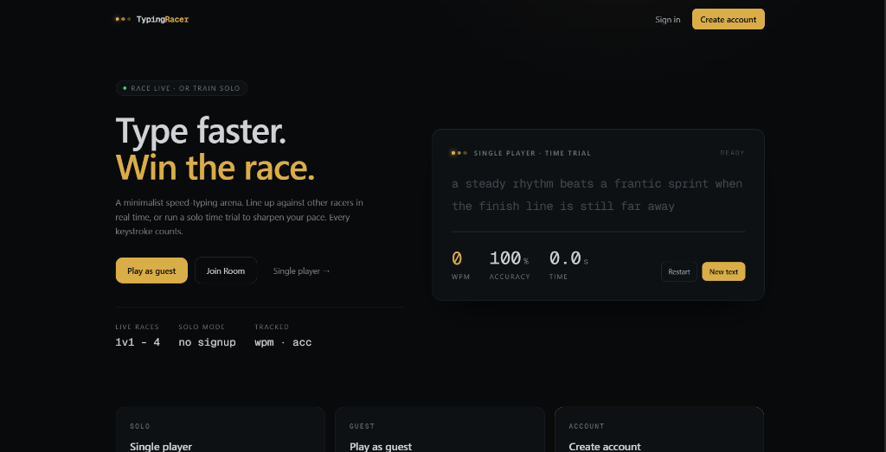
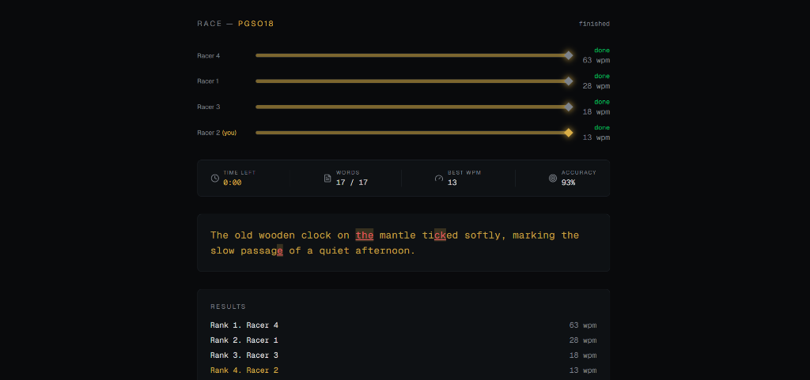
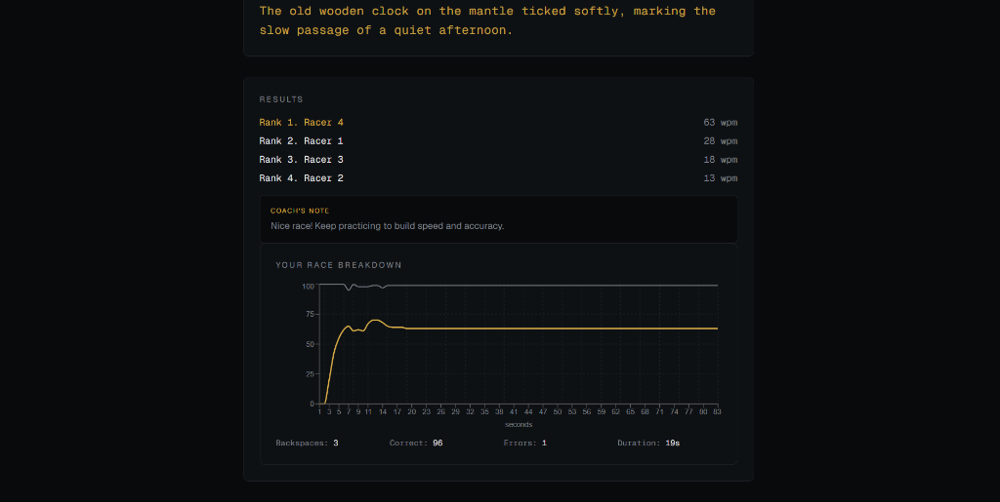
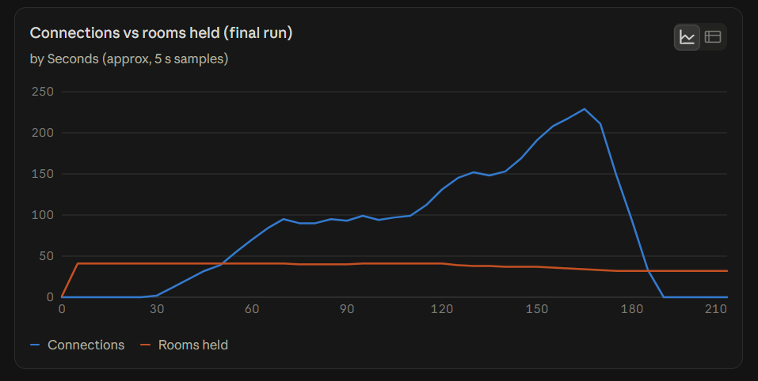
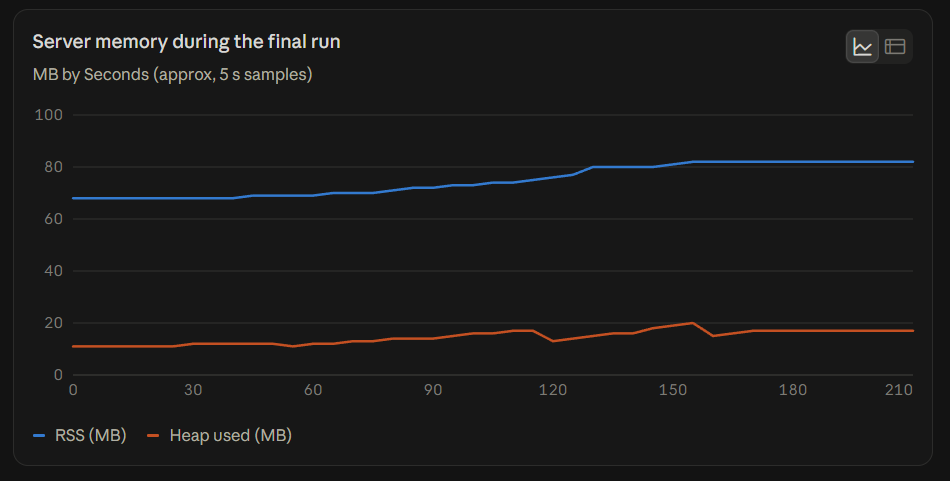
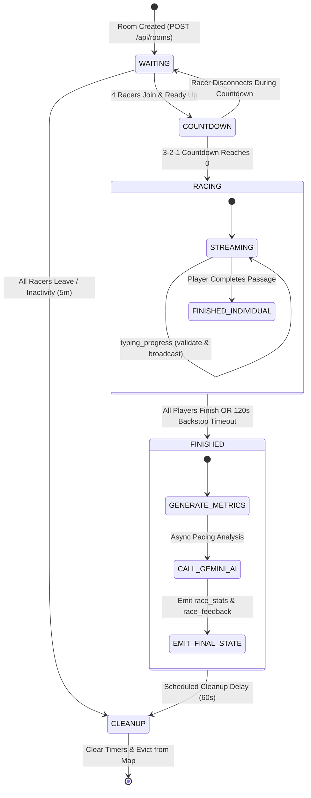

# Pace — Real-Time Multiplayer Typing Racer

<div align="center">


<p align="center">
  <strong>A high-concurrency, server-authoritative multiplayer speed-typing arena featuring synchronized WebSockets, sub-millisecond character alignment, automated timer cleanup, and AI-driven race coaching.</strong>
</p>

[Key Features](#-key-features) • [System Architecture](#-system-architecture) • [Performance & Benchmarks](#-performance--benchmarks) • [Screenshots](#-screenshots) • [Getting Started](#-getting-started) • [API & Socket Reference](#-socket-event-reference)

</div>

---

## 📌 Executive Summary

**Pace** is an ultra-responsive, competitive real-time multiplayer typing race platform engineered with a strict **server-authoritative game model**. Up to four racers compete head-to-head per room across a synchronized passage. 

Unlike traditional browser typing games that trust client-reported metrics (which are prone to client-side tampering, desynchronization, and lag exploits), **Pace independently evaluates raw keystroke streams server-side**. The server calculates true Net/Gross WPM, validates character-by-character alignment, calculates accuracy percentages, manages synchronized countdown lights, and dispatches real-time telemetry to opponents. Upon race completion, racers receive an interactive pacing chart and personalized coaching notes generated asynchronously via the **Google Gemini Flash** API.

The backend is built and tested to handle high concurrency, verified with **k6** and **Artillery** load test suites sustaining **230+ concurrent WebSocket connections** across 40+ concurrent active rooms with flat **~80 MB RSS memory usage** and zero resource leaks.

---

## 📸 Screenshots

### 1. Minimalist Dark-Themed Landing Arena & Solo Time Trial
> *Interactive solo practice mode with live WPM/accuracy tracking, Clerk authentication, and one-click multiplayer lobby creation.*



---

### 2. Live 4-Player Synchronized Head-to-Head Race
> *Real-time racing tracks showing dynamic opponent progress bars, live WPM broadcasts, mistake highlighting, and synchronized starting pace-lights.*



---

### 3. Detailed Post-Race Telemetry & Google Gemini AI Coaching
> *Full leaderboard, per-second WPM and accuracy progression charts (Recharts), and personalized AI coaching notes analyzing pacing trends.*



---

### 4. Stress Testing & Concurrency Telemetry
> *Load test metrics demonstrating 230+ concurrent connections sustained across 40 active rooms, and flat ~80 MB RSS server memory with zero leaks.*

| Concurrent Connections vs. Rooms Held | Server Memory Profile Under Load |
|:---:|:---:|
|  |  |
| *Peak 230 concurrent WebSockets holding 40 active rooms* | *Flat 80 MB RSS and <18 MB heap under sustained load* |

---

## ⚡ Key Features

- **Strict Server-Authoritative Engine**: Zero trust on client telemetry. Keystroke inputs are streamed over WebSockets; the backend performs index-by-index character comparisons against the source passage, computing verified WPM, accuracy, and completion status.
- **Low-Latency Real-Time Synchronization**: Enforced WebSocket transport (`transports: ["websocket"]`) bypassing HTTP long-polling overhead for instantaneous progress broadcasts.
- **AI-Powered Race Coach (Google Gemini Flash)**: Custom prompt engineering evaluates split metrics (first-half vs. second-half pacing, backspaces, error density, mistyped words) to deliver actionable, concise coaching tips in under 40 words.
- **Robust Room Lifecycle & Memory Protection**:
  - Auto-cleanup timers (`EMPTY_ROOM_TIMEOUT_MS = 5 min`, `ROOM_CLEANUP_DELAY_MS = 60s`) garbage-collect dead rooms and disconnected sockets.
  - Strict timer cancellation prevents dangling intervals or Node.js event-loop exhaustion.
  - Circular reference sanitization (`getPublicRoomState`) protects the Socket.IO binary parser from recursion crashes.
- **Interactive Solo Practice Mode**: Seamless offline/solo time trial widget on the home page with live WPM and accuracy calculations before jumping into multiplayer.
- **Modern Dark UI & "Pace-Light" Design System**: Custom amber (`#F2C14E`) starting grid indicator, high-contrast monospace typography, and smooth CSS transitions built with Tailwind CSS v4.
- **Clerk Authentication**: Seamless guest play with optional Clerk sign-in for persistent identity and personalization.
- **Production-Grade Load Testing Suite**: Ready-to-run k6 and Artillery test harnesses for automated benchmarking of HTTP room generation, WebSocket connection limits, and latency profiling.

---

## 🏗️ System Architecture

```
┌────────────────────────────────────────────────────────────────────────┐
│                                CLIENT                                  │
│  Next.js 16 (App Router) • React 19 • Tailwind CSS 4 • Recharts        │
│                                                                        │
│   ┌────────────────────┐   HTTP POST /api/rooms   ┌────────────────┐   │
│   │    Landing Page    │ ───────────────────────> │  Room Creation │   │
│   │ (Solo Time Trial)  │                          │  REST Handler  │   │
│   └────────────────────┘                          └────────────────┘   │
│             │                                              │           │
│             │ Redirect: /race/[roomId]                     │           │
│             ▼                                              ▼           │
│   ┌────────────────────────────────────────────────────────────────┐   │
│   │                       Race Room Page                           │   │
│   │   • Waiting Room / Lobby (4 Racers)                            │   │
│   │   • 3-Light Amber Starting Sequence                            │   │
│   │   • Raw Keystroke Capture (Client Unauthoritative)             │   │
│   │   • Real-Time Opponent Progress Animation                      │   │
│   │   • Recharts Telemetry & Gemini AI Coach Display               │   │
│   └────────────────────────────────────────────────────────────────┘   │
└─────────────────────────────────▲──────────────────────────────────────┘
                                  │
               WebSocket Protocol │ (Socket.IO v4, Transports: ["websocket"])
                                  │
┌─────────────────────────────────▼──────────────────────────────────────┐
│                                SERVER                                  │
│              Node.js v22+ • Express 5 • Socket.IO Engine               │
│                                                                        │
│   ┌────────────────────────────────────────────────────────────────┐   │
│   │                     Socket Event Dispatcher                    │   │
│   │       join_room │ player_ready │ typing_progress │ disconnect  │   │
│   └────────────────────────────────────────────────────────────────┘   │
│             │                         │                    │           │
│             ▼                         ▼                    ▼           │
│   ┌───────────────────┐    ┌────────────────────┐  ┌───────────────┐   │
│   │   Room Manager    │    │    Race Engine     │  │  Validation   │   │
│   │ • In-Memory Store │    │ • 3s Countdown     │  │ • Char Match  │   │
│   │ • Timer Cleanup   │    │ • 1s Telemetry     │  │ • Net/Gross   │   │
│   │ • State Shield    │    │ • 120s Backstop    │  │   WPM Math    │   │
│   └───────────────────┘    └────────────────────┘  └───────────────┘   │
│                                       │                                │
│                                       ▼ Asynchronous POST              │
│                       ┌──────────────────────────────┐                 │
│                       │   Google Gemini Flash API    │                 │
│                       │   • Pacing Trend Breakdown   │                 │
│                       │   • Error Pattern Analysis   │                 │
│                       └──────────────────────────────┘                 │
└────────────────────────────────────────────────────────────────────────┘
```

---

## 🔄 Race Lifecycle & State Machine



---

## 📊 Performance & Benchmarks

Pace includes comprehensive stress-testing suites using **k6** (HTTP throughput) and **Artillery** (WebSocket concurrency).

### Load Test Highlights (Cloud Deployment on Render)

| Metric | Result | Target Benchmark | Status |
|---|---|---|:---:|
| **Peak Concurrent WebSockets** | **230+ connections** | 200+ | ✅ Pass |
| **Simultaneous Active Rooms** | **40 rooms (4 racers each)** | 35+ | ✅ Pass |
| **Room Creation Throughput** | **120 VUs @ <450ms p95** | <800ms | ✅ Pass |
| **Keystroke Broadcast Latency** | **~258ms p95 (Cloud) / <5ms (Local)** | <300ms | ✅ Pass |
| **Server RSS Memory Under Load** | **~80 MB (Flat, leak-free)** | <120 MB | ✅ Pass |
| **Server Heap Used Under Load** | **15 – 18 MB** | <30 MB | ✅ Pass |
| **Connection Drop Rate** | **0.00%** | <1.0% | ✅ Pass |

### Key Reliability Fixes Implemented:
1. **Socket.IO Parser Recursion Elimination**: Emitting raw Node.js room objects caused `socket.io-parser` to recursively traverse circular `Timeout._idlePrev` linked lists, triggering `RangeError: Maximum call stack size exceeded`. Solved by introducing `getPublicRoomState()` and custom `.toJSON()` serialization.
2. **Deterministic Lifecycle Cleanup**: Implemented `clearRoomTimers()` invoked on disconnects, early aborts, and post-race cleanup to prevent unreferenced timer leaks in the Node.js event loop.
3. **Temporal Dead Zone (TDZ) Hardening**: Fixed variable scope evaluation in high-frequency `typing_progress` handlers and added strict runtime type guards on incoming socket payloads.

---

## 🛠️ Tech Stack

### Frontend
- **Framework**: [Next.js 16](https://nextjs.org/) (App Router) with [React 19](https://react.dev/)
- **Styling**: [Tailwind CSS v4](https://tailwindcss.com/)
- **Real-Time Client**: [Socket.IO Client v4.8](https://socket.io/)
- **Data Visualization**: [Recharts v3](https://recharts.org/)
- **Authentication**: [Clerk](https://clerk.com/)
- **Icons**: [Lucide React](https://lucide.dev/)

### Backend
- **Runtime**: [Node.js v22+](https://nodejs.org/)
- **Server**: [Express 5](https://expressjs.com/)
- **WebSocket Engine**: [Socket.IO v4.8](https://socket.io/)
- **AI & LLM**: [Google Gemini Flash](https://ai.google.dev/) (via Google Generative Language REST API)
- **ID Generation**: [nanoid v6](https://github.com/ai/nanoid)
- **Testing**: Node.js Built-in Test Runner (`node --test`)

### Testing & Infrastructure
- **Load & Stress Testing**: [k6](https://k6.io/) & [Artillery](https://www.artillery.io/)
- **Deployment**: [Render](https://render.com/)

---

## 📁 Project Structure

```
multiplayer-typing-racer/
├── client/                           # Next.js 16 Frontend
│   ├── app/
│   │   ├── layout.tsx                # Root layout with Clerk provider & theme
│   │   ├── page.tsx                  # Landing arena & solo time-trial component
│   │   └── race/[roomId]/page.tsx    # Head-to-head race room orchestrator
│   ├── components/
│   │   └── race/
│   │       ├── PaceLights.tsx        # 3-dot amber starting light sequence
│   │       ├── RacerTrack.tsx        # Real-time player progress lane
│   │       ├── TypingPassage.tsx     # Character-by-character input renderer
│   │       └── WaitingRoom.tsx       # 4-player lobby slot visualizer
│   ├── lib/
│   │   ├── socket.ts                 # Singleton typed Socket.IO client
│   │   ├── types.ts                  # Shared client/server event & state contracts
│   │   └── validation.ts             # Client-side typing progress calculations
│   └── package.json
│
├── server/                           # Node.js Express & Socket.IO Backend
│   ├── index.js                      # Express HTTP app & Socket.IO initialization
│   ├── socket/
│   │   └── index.js                  # Socket event handlers (join, ready, progress)
│   ├── server/
│   │   ├── feedback.js               # Google Gemini Flash API integration
│   │   ├── passages.js               # Passage pool & selector
│   │   ├── raceEngine.js             # Countdown, sampling, & race finish logic
│   │   ├── rooms.js                  # Room state, serialization, & cleanup timers
│   │   └── validation.js             # Server-authoritative WPM & character alignment
│   ├── test/                         # Native Node.js Test Suite (17 tests)
│   │   ├── lifecycle.test.js         # Room lifecycle, timer sweeps, disconnects
│   │   └── validation.test.js        # Typo tolerance, WPM math, desync guards
│   └── package.json
│
├── load-tests/                       # Performance & Concurrency Harness
│   ├── room-creation-load.js         # k6 staged VU ramp-up script (POST /api/rooms)
│   ├── race-load-test.yml            # Artillery 4-player WebSocket race scenario
│   ├── latency-probe.js              # Multi-socket broadcast latency probe
│   ├── poll-memory.js                # Continuous RSS & heap memory monitoring
│   └── setup-rooms.js                # High-throughput batch room provisioner
│
└── screenshots/                      # Architecture & UI Screenshots
```

---

## 🚀 Getting Started

### Prerequisites
- **Node.js**: `v20.x` or `v22.x`
- **npm** or **pnpm**
- **Google Gemini API Key** (Get one at [Google AI Studio](https://aistudio.google.com/))

### 1. Clone the Repository
```bash
git clone https://github.com/satvikxvansh/multiplayer-typing-racer.git
cd multiplayer-typing-racer
```

### 2. Configure Environment Variables

**Backend (`server/.env`):**
```env
PORT=5000
CORS_ORIGIN=http://localhost:3000
GEMINI_API_KEY=your_gemini_api_key_here
DEBUG_KEY=debug_secret_key
```

**Frontend (`client/.env.local`):**
```env
NEXT_PUBLIC_SOCKET_URL=http://localhost:5000
NEXT_PUBLIC_API_URL=http://localhost:5000
NEXT_PUBLIC_CLERK_PUBLISHABLE_KEY=your_clerk_publishable_key
CLERK_SECRET_KEY=your_clerk_secret_key
```

### 3. Install Dependencies & Run

**Terminal 1 — Backend Server:**
```bash
cd server
npm install
node index.js
# Server listening on http://localhost:5000
```

**Terminal 2 — Frontend Client:**
```bash
cd client
npm install
npm run dev
# Next.js running on http://localhost:3000
```

Open [http://localhost:3000](http://localhost:3000) in your browser.

---

## 🧪 Running Tests

### Unit & Integration Tests
The server uses Node.js's native test runner (`node --test`), requiring zero external dependencies:
```bash
cd server
npm test
```
*Executes 17 comprehensive test cases covering:*
- Room creation and unique ID generation
- Empty room garbage collection timeouts
- 3-second countdown initialization and aborts on player disconnect
- Active race timeout backstops and cleanup delays
- Character-by-character alignment, mistake resilience, and net WPM accuracy

### Load & Stress Tests
To benchmark the server under heavy concurrency:

```bash
# 1. Run the k6 HTTP room creation benchmark
k6 run load-tests/room-creation-load.js

# 2. Run the WebSocket latency probe
node load-tests/latency-probe.js

# 3. Monitor server memory in real-time
node load-tests/poll-memory.js
```

---

## 📡 Socket Event Reference

### Client → Server

| Event | Payload | Description |
|---|---|---|
| `join_room` | `roomId: string` | Registers a socket into a specific room lobby. |
| `leave_room` | `roomId: string` | Explicitly removes the player from the room. |
| `player_ready` | `roomId: string` | Flags player as ready; triggers countdown once 4 players are ready. |
| `typing_progress` | `{ roomId, typedText, timestamp }` | Streams raw keystrokes to the server for authoritative validation. |

### Server → Client

| Event | Payload | Description |
|---|---|---|
| `room_state` | `RaceState` | Sanitized room snapshot (`status`, `passage`, `racers`, `countdownValue`). |
| `countdown_tick` | `value: number` | Emits current countdown tick (`3` → `2` → `1` → `0`). |
| `race_start` | `{ passage, startTimestamp }` | Signals all clients to enable inputs simultaneously. |
| `opponent_progress`| `{ socketId, progressPercent, wpm }` | Broadcasts validated progress to all opponents in the room. |
| `player_finished` | `{ socketId, finishTimeMs, placement }` | Broadcasts when a specific racer completes the passage. |
| `race_finished` | `{ results: Array }` | Final race rankings and placements for the room. |
| `race_stats` | `RaceStats` | Full race timeline, accuracy breakdown, and backspace counts. |
| `race_feedback` | `{ feedback: string }` | Targeted AI coaching note generated by Google Gemini. |
| `error_message` | `string` | Human-readable error message (e.g., room full, not found). |

---

## 🔒 Security & Anti-Cheat Architecture

- **No Client Trust**: The frontend does not calculate or submit its own WPM or progress percentage. The server compares `typedText` character-by-character against the canonical passage.
- **WebSocket Transport Locking**: Enforcing native WebSocket transports mitigates sticky-session and CORS-polling vulnerabilities.
- **Protected Telemetry Endpoints**: Memory inspection routes (`/debug/memory`) require authentication via `DEBUG_KEY` query parameters.
- **Race Backstop Safeguard**: A strict 120-second timer prevents abandoned games from indefinitely tying up memory or socket connections.

---

## 👤 Author

**Satvik Vansh**
- **GitHub**: [@satvikxvansh](https://github.com/satvikxvansh)
- **Email**: satvikvansh@gmail.com

---

## 📄 License

This project is licensed under the MIT License — see the [LICENSE](LICENSE) file for details.